# RISC-V core

SystemVerilog implementation of RISC-V RV32IM & custom packed SIMD ISA as a 5-stage scalar M-mode core, with L1 caches and branch predictors  

- [RISC-V core](#risc-v-core)
- [Getting the project](#getting-the-project)
  - [Prerequisites](#prerequisites)
  - [Quick start](#quick-start)
- [Microarchitecture](#microarchitecture)
  - [High-level description](#high-level-description)
    - [Icache](#icache)
    - [Branch predictor](#branch-predictor)
    - [Dcache](#dcache)
    - [Register File](#register-file)
    - [RV32 integer multiplier \& SIMD unit](#rv32-integer-multiplier--simd-unit)
    - [RV32 restoring binary divider](#rv32-restoring-binary-divider)
    - [Main memory](#main-memory)
    - [Hierarchy](#hierarchy)
- [Measured Performance - FPGA emulation](#measured-performance---fpga-emulation)
  - [Plots and data](#plots-and-data)
- [Verification](#verification)
  - [Environment](#environment)
- [FPGA emulation](#fpga-emulation)
- [Analysis example use-case: Dhrystone](#analysis-example-use-case-dhrystone)
  - [Execution log](#execution-log)
  - [Callstack](#callstack)
  - [Profiled instructions](#profiled-instructions)
  - [Execution trace](#execution-trace)
  - [Hardware stats](#hardware-stats)
  - [Kanata log](#kanata-log)
  - [Analysis scripts](#analysis-scripts)
    - [Flat profile](#flat-profile)
    - [TDA](#tda)
    - [FlameGraph](#flamegraph)
    - [Call Graph](#call-graph)
    - [Execution visualization](#execution-visualization)
    - [Hardware performance estimates correlation](#hardware-performance-estimates-correlation)

# Getting the project
Project relies on a few external libraries and tools. Clone recursively with
```sh
git clone --recurse-submodules git@github.com:AleksandarLilic/ama-riscv.git
```

## Prerequisites
Submodules are pulled automatically with `--recurse-submodules`

- **Vivado** (tested on 2023.2)
- **GCC** >= 10 (C++17, `gnu++17`)
- **Make**
- **Python**
- Prerequisites of [./sim](./sim) submodule

## Quick start

To check that everything is available and working as expected:
1. build RTL & testbench
2. build cosim
3. run the test and check the logs

``` sh
# set up environment variables
source setup.sh
# build test
cd sim/sw/baremetal/asm_rv32i
make
cd -
# build and run RTL
run -t sim/sw/baremetal/asm_rv32i/test.hex -v VERBOSE
# check the execution log
vim testrun_<run_date>/asm_rv32i_test/test.log
```

Outputs:
```sh
ls testrun_<run_date>/asm_rv32i_test
asm_rv32i_test_out_cosim  build.log  cosim  Makefile  Makefile.inc  make_run_default.log  run.sh  test.log  test.status  work.ama_riscv_tb.wdb  xsim.dir
```

Cosim outputs:
```sh
ls testrun_<run_date>/asm_rv32i_test/asm_rv32i_test_out_cosim/
asm_rv32i_test.kanata.log  callstack_folded_clk_cycle.txt  hw_stats.json  inst_profile_clk.json  trace_clk.bin  uart.log
```

Second option is to use testlist instead of manually specifying each test. Optionally, testlist can be filtered e.g. using "simple" group filter, adding rundir, and timeout in number of clock cycles
```sh
run --testlist ../testlist.yaml -r testrun_demo -c 1000000 -f "simple"
```

Add `-k` to keep the build and `-p` to keep already passed tests (together with the same `--rundir`), reduce expected runtime/timeout, and run official RISC-V ISA tests
```sh
run --testlist ../testlist.yaml -r testrun_demo -c 5000 -f "riscv_isa_rv32i" -kp
```

Running `-v VERBOSE` should be done with care since it will slow down execution. For short tests, the difference is insignificant, while for longer ones it can add minutes to the simulation time, and create a large log.  
Similarly, running with `-testplusarg enable_konata` and `-testplusarg prof_trace` can create large kanata and profiler trace logs.  

# Microarchitecture

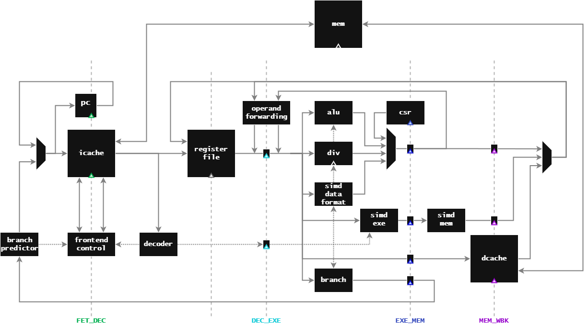

## High-level description

Core supports `RV32IM_zicsr_zifencei_zicntr_zihpm_xsimd` ([rv drom](https://rv.drom.io/?RV32IM_zicsr_zifencei_zicntr_zihpm_xsimd)) or any legal subset ([gcc `-march` options](https://gcc.gnu.org/onlinedocs/gcc-14.2.0/gcc/RISC-V-Options.html#index-march-14))

Core microarchitecture follows a fairly standard 5-stage single issue RISC-style pipeline:
- FET:
  - Core select PC source.
  - Icache does address generation and tag lookup.
  - Branch predictor logically sits here.
- FET_DEC pipe:
  - Icache responds with one instruction.
  - Next PC is prepared.
- DEC:
  - Core decodes the instruction, generates immediate-based next PC for conditional direct branches (`b*`) and unconditional direct branches (`jal`).
  - Pipeline information is sent to the branch predictor; Next PC is predicted and frontend redirected if needed.
  - Source registers are either read, or bypassed from the backend. Core progresses even if not all operands are available.
- DEC_EXE pipe:
  - Control signals and (all available) operands are propagated to EXE stage.
- EXE:
  - Core executes arithmetic, logic, and control flow instructions in this one cycle.
  - RV32 multiplier and SIMD finish first (out of two) execution cycle.
  - RV32 restoring binary divider starts, takes 2 to 34 cycles to finish (data dependent).
  - SIMD data formatting unit executes.
  - First part of Dcache address generation is done.
  - If source operand(s) are not available through register read nor in the bypass network, machine stalls.
- EXE_MEM pipe:
  - Available results and relevant control signals are propagated to MEM stage.
  - RV32 multiplier and SIMD unit propagates first stage results.
  - Branch results are propagated to MEM stage.
- MEM:
  - RV32 multiplier and SIMD unit finishes second execution cycle.
    - SIMD unit takes in `late_c` in case it's a dot product instruction either from EXE_MEM pipe or bypass network, so no penalty is incurred on back-to-back `dot`s to the same accumulator.
  - Resolution of conditional direct branches (`b*`) and unconditional indirect branches (`jalr`) is available.
  - On branch miss or `jalr` instruction, frontend is redirected, taking 2 cycle miss penalty (`b*`) or 2 cycle stall (`jalr`).
  - Dcache does second part of the address generation, and tag lookup.
- MEM_WBK pipe:
  - Available results and relevant control signals are propagated to WBK stage.
  - RV32 multiplier and SIMD results are propagated to WBK stage
  - Dcache loads or stores data.
- WBK:
  - Result from RV32 multiplier and SIMD unit is ready
  - Dcache returns loaded data.
- RETIRE pipe:
  - Instruction retires, optionally writes to RF.
  - Performance events about this cycle are collected.

Default parameters are set in `src/ama_riscv_defines.svh` and `src/ama_riscv_types.svh`  

### Icache
- 4KB, 32-set, 2-way, 64B lines, 128-bit bus, LRU replacement policy
- Parametrizable for number of sets and ways, with one bank per way
- 1 clock cycle on hit, 7 on miss
- Speculative misses are immediately aborted on a branch miss (upon resolution)
- Configuration driven by sweeps via [hw_model_sweep.py](sim/script/hw_model_sweep.py) and [cache config](sim/script/hw_model_sweep_params_caches.json); results are under [examples/hw_sweeps](examples/hw_sweeps)

### Branch predictor
Follows the combined predictor from [McFarling's "Combining Branch Predictors"](https://american.cs.ucdavis.edu/academic/readings/papers/mcfarling.pdf)
- Combined predictor: bimodal + global, with a meta predictor
- No penalty on hit, 2 cycle penalty on miss, predicts back-to-back branches
- Parametrizable - options: static, bimodal, global, gshare, gselect, combined
- Chosen through sweeps + config constraints: due to timing considerations, no PHT is bigger than 2^8 entries, i.e. no more than 8 bits are used for indexing
- Configuration driven by sweeps via [hw_model_sweep.py](sim/script/hw_model_sweep.py) and [bp config](sim/script/hw_model_sweep_params_bp_guided_focused.json) (see [sim sweeps](sim/README.md#hardware-model-sweeps)); results are under [examples/hw_sweeps](examples/hw_sweeps)

### Dcache
- 4KB, 16-set, 4-way, 64B lines, 128-bit bus, LRU replacement policy with writeback
- Parametrizable for number of sets and ways, with one bank per way
- 1 clock cycle on hit, 7 on miss, 10 on miss with writeback; 1 cycle penalty on load to use
- Configuration driven by sweeps, same flow and config as Icache (results are under [examples/hw_sweeps](examples/hw_sweeps))

### Register File
3R2W design, banked by default
- Address of a 2nd write port is `rd_addr + 1`
- Address of rs3 is rd (used only for dot* instructions)
- Optionally banked as odd/even such that rd and rdp paired writes always land in a different bank

### RV32 integer multiplier & SIMD unit
2-cycle pipelined unit (EXE -> MEM), shared across rv32 `mul*` and packed SIMD arithmetic instructions
- Single 32x32 Baugh-Wooley partial product array reduced through a CSA tree, reused across all element widths via diagonal lane masks: the full products are computed once, and the narrower (or accumulated) results are picked at the output mux
- First stage builds and reduces the partial products, second stage finishes reduction and does the final add and result select
- For `dot*` instructions, `rs3` is passed or forwarded as `late_c` in SIMD unit second stage, so back-to-back `dot`s to the same accumulator don't cause stalls

### RV32 restoring binary divider
32-bit restoring binary divider with clz-based normalization and a one-entry result cache
- Common case: `3 + (cnt_b - cnt_a + 1)` (cnt_a=clz(|dividend|), cnt_b=clz(|divisor|)) - 1 cycle start, 1 cycle setup, 1 cycle per dividend bit offset for the number of cnt_b bits, 1 cycle fixup
- Special case: `2` - 1 cycle start and 1 cycle setup
- Cache hit: `1` - combinational hit + flop the output

### Main memory
- Caches are backed by a single main memory, parametrizable size, defaults to 128K
- True dual port, 128-bit bus, 16B words
- `$readmemh` is used to load in the workload's `.mem` file
  - For verification, `ama_riscv_tb` writes the file
  - For FPGA emulation, synthesis writes the initial file, later patched as needed (check [FPGA emulation](#fpga-emulation) for details).

### Hierarchy
```sh
ama_riscv_top               # Design top
├── ama_riscv_core_top      # Core & caches wrapper
│   ├── ama_riscv_core      # CPU pipeline
│   │   ├── ...             # All core modules
│   ├── ama_riscv_icache    # L1 instruction cache
│   │   └── mem             # memory banks
│   └── ama_riscv_dcache    # L1 data cache
│       └── mem             # memory banks
├── ama_riscv_mem           # Unified backing memory
└── ama_riscv_uart          # Memory-mapped UART
    └── uart                # TX & RX subsystem
        ├── ...             # TX & RX PHYs
```

For verification, `ama_riscv_top` is instantiated as DUT in the `ama_riscv_tb` testbench.  
For FPGA emulation, `ama_riscv_top` is instantiated in the `ama_riscv_fpga` FPGA wrapper.

# Measured Performance - FPGA emulation

Emulation is ran at 50MHz on Arty A7-100T board. Since the design is fully synchronous, change in clock frequency by X would yield the same change in speed by X, thus keeping the 'per MHz' result the same.

- Dhrystone: 81 DMIPS, 1.63 DMIPS/MHz (IPC: 0.91)
- Coremark: 145 Coremarks, 2.9 Coremarks/MHz (IPC: 0.89)
- STREAM-INT: 
  - Copy: 66 MB/s
  - Scale: 49 MB/s
  - Add: 64 MB/s
  - Triad: 57 MB/s
- Embench_1.0 compiled for speed (with [detailed breakdown](examples/perf_runs_fpga/benchmark_results/embench_results.md)): 
  - Size: 9.49 (4.32 - 20.85)
  - Speed: 51.01 (33.49 - 77.69)
  - Speed/MHz: 1.02 (0.67 - 1.55)

SIMD ISA improvements on MLP, measured in inferences per second

| Flavor | `RV32IM`<br>[inf/s] | `RV32IM_Xsimd`<br>[inf/s] | Improvement |
| ---- | --- | ---- | ---- |
| w8a8 | 238 | 1968 | 8.3x |
| w4a8 | 228 | 1984 | 8.7x |
| w2a8 | 293 | 2083 | 7.1x |

## Plots and data

All TDA and counter plots are available under [examples/perf_runs_fpga](examples/perf_runs_fpga)  
- [plots_benchmarks.pdf](examples/perf_runs_fpga/plots_benchmarks.pdf)
- [plots_mlp.pdf](examples/perf_runs_fpga/plots_mlp.pdf)
- [plots_ustress.pdf](examples/perf_runs_fpga/plots_ustress.pdf)

With CSV summaries under the same directory
- [hw_stats_benchmarks.csv](examples/perf_runs_fpga/hw_stats_benchmarks.csv)
- [hw_stats_mlp.csv](examples/perf_runs_fpga/hw_stats_mlp.csv)
- [hw_stats_ustress.csv](examples/perf_runs_fpga/hw_stats_ustress.csv)

All breakdowns are available under [examples/perf_runs_fpga/all_stats](examples/perf_runs_fpga/all_stats)  

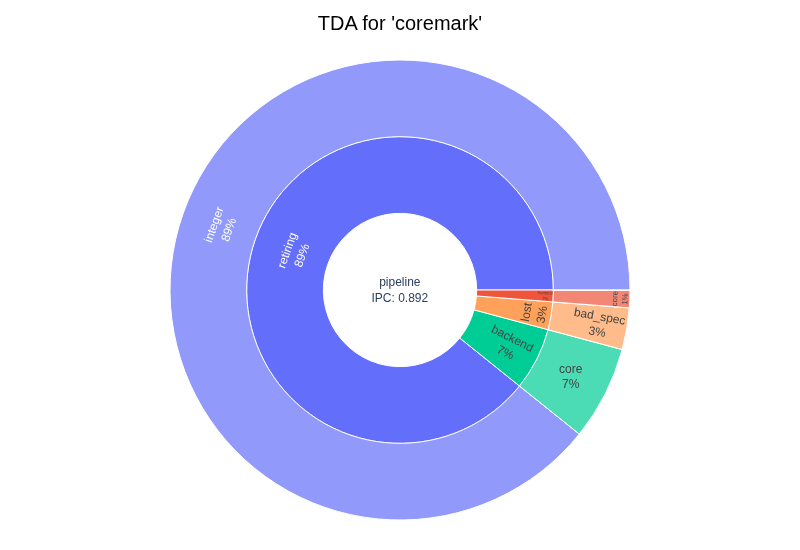

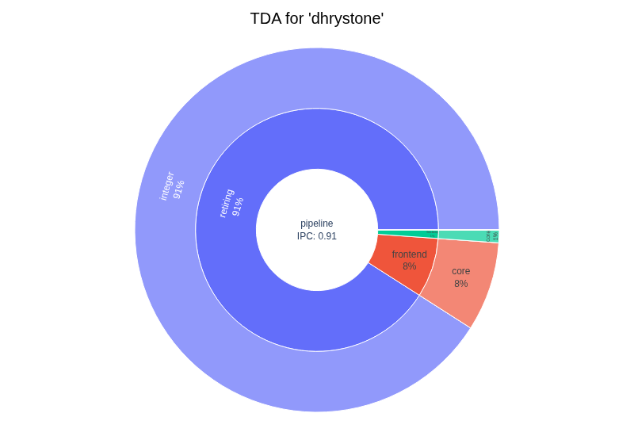

# Verification

There are two supported mechanisms for functional verification:
1. Self-checking C/ASM tests use `tohost` CSR LSB where testbench waits for `tohost[0] == 1` to end the simulation. In case of a failing test, `tohost[31:1]` reports the failed ID
2. Cosim - instruction set simulator [ama-riscv-sim](https://github.com/AleksandarLilic/ama-riscv-sim) tied up over DPI and single-stepped from testbench after each retired instruction in RTL. Checkers are set up on the architectural state (32 GP registers, and PC)

On the RTL level, one or both methods can be used. Since cosim relies on probing internal signals, cosim is unsupported out of the box for GLS.

As shown above, running tests is done through `./run_test.py` script (aliased to `run` in `setup.sh`)
Full usage available in [examples/run.help](examples/run.help)

## Environment
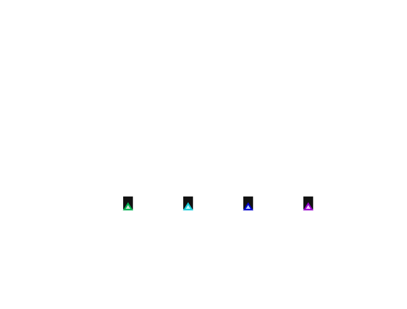

# FPGA emulation

Design is synthesized with conservative 50MHz constraint for the emulation purposes, targeting `xc7a100tcsg324-1` part on Arty A7-100T board.  

Defines used for synthesis:  
```tcl
set_property verilog_define { SYNT FPGA FPGA_HEX_PATH=<workdir>/ama-riscv/sim/sw/baremetal/uart_direct_send/hello_world.mem } [current_fileset]
```

Main memory is later patched with workload(s) of interest via [script/update_mem.sh](script/update_mem.sh) and loaded into the FPGA with [script/flash_bit.tcl](script/flash_bit.tcl).

Utilization overview:  
```
+----------------------------+-------+-------+------------+-----------+-------+
|          Site Type         |  Used | Fixed | Prohibited | Available | Util% |
+----------------------------+-------+-------+------------+-----------+-------+
| Slice LUTs                 | 11264 |     0 |          0 |     63400 | 17.77 |
|   LUT as Logic             | 11132 |     0 |          0 |     63400 | 17.56 |
|   LUT as Memory            |   132 |     0 |          0 |     19000 |  0.69 |
|     LUT as Distributed RAM |   132 |     0 |            |           |       |
|     LUT as Shift Register  |     0 |     0 |            |           |       |
| Slice Registers            |  4964 |     0 |          0 |    126800 |  3.91 |
|   Register as Flip Flop    |  4964 |     0 |          0 |    126800 |  3.91 |
|   Register as Latch        |     0 |     0 |          0 |    126800 |  0.00 |
| F7 Muxes                   |   398 |     0 |          0 |     31700 |  1.26 |
| F8 Muxes                   |   151 |     0 |          0 |     15850 |  0.95 |
+----------------------------+-------+-------+------------+-----------+-------+
```

First three logic levels, with percentage contribution compared to part's total resource availability  
```
+--------------------------+--------------------+---------------+---------------+------------+-------------+------------+----------+------------+
|         Instance         |       Module       |   Total LUTs  |   Logic LUTs  |   LUTRAMs  |     FFs     |   RAMB36   |  RAMB18  | DSP Blocks |
+--------------------------+--------------------+---------------+---------------+------------+-------------+------------+----------+------------+
| ama_riscv_fpga           |              (top) | 11264(17.77%) | 11132(17.56%) | 132(0.69%) | 4964(3.91%) | 44(32.59%) | 0(0.00%) |   0(0.00%) |
|   (ama_riscv_fpga)       |              (top) |      8(0.01%) |      8(0.01%) |   0(0.00%) |   28(0.02%) |   0(0.00%) | 0(0.00%) |   0(0.00%) |
|   ama_riscv_top_i        |      ama_riscv_top | 11256(17.75%) | 11124(17.55%) | 132(0.69%) | 4936(3.89%) | 44(32.59%) | 0(0.00%) |   0(0.00%) |
|     ama_riscv_core_top_i | ama_riscv_core_top | 11155(17.59%) | 11023(17.39%) | 132(0.69%) | 4842(3.82%) |  12(8.89%) | 0(0.00%) |   0(0.00%) |
|       ama_riscv_core_i   |     ama_riscv_core |  8912(14.06%) |  8780(13.85%) | 132(0.69%) | 3513(2.77%) |   0(0.00%) | 0(0.00%) |   0(0.00%) |
|       ama_riscv_dcache_i |   ama_riscv_dcache |   1776(2.80%) |   1776(2.80%) |   0(0.00%) |  789(0.62%) |   8(5.93%) | 0(0.00%) |   0(0.00%) |
|       ama_riscv_icache_i |   ama_riscv_icache |    467(0.74%) |    467(0.74%) |   0(0.00%) |  540(0.43%) |   4(2.96%) | 0(0.00%) |   0(0.00%) |
|     ama_riscv_mem_i      |      ama_riscv_mem |     27(0.04%) |     27(0.04%) |   0(0.00%) |    2(0.01%) | 32(23.70%) | 0(0.00%) |   0(0.00%) |
|       (ama_riscv_mem_i)  |      ama_riscv_mem |      9(0.01%) |      9(0.01%) |   0(0.00%) |    2(0.01%) |   0(0.00%) | 0(0.00%) |   0(0.00%) |
|       u_mem              |  xpm_memory_tdpram |     20(0.03%) |     20(0.03%) |   0(0.00%) |    0(0.00%) | 32(23.70%) | 0(0.00%) |   0(0.00%) |
|     ama_riscv_uart_i     |     ama_riscv_uart |     75(0.12%) |     75(0.12%) |   0(0.00%) |   92(0.07%) |   0(0.00%) | 0(0.00%) |   0(0.00%) |
|       (ama_riscv_uart_i) |     ama_riscv_uart |     21(0.03%) |     21(0.03%) |   0(0.00%) |   44(0.03%) |   0(0.00%) | 0(0.00%) |   0(0.00%) |
|       uart_i             |               uart |     54(0.09%) |     54(0.09%) |   0(0.00%) |   48(0.04%) |   0(0.00%) | 0(0.00%) |   0(0.00%) |
+--------------------------+--------------------+---------------+---------------+------------+-------------+------------+----------+------------+
```

Detailed utilization reports are available under [examples/perf_runs_fpga/fpga_synt_reports](examples/perf_runs_fpga/fpga_synt_reports)

# Analysis example use-case: Dhrystone
> [!NOTE]
> Tests, profiling, and logging are heavily reused from [ama-riscv-sim](https://github.com/AleksandarLilic/ama-riscv-sim) and therefore only differences introduced in the RTL environment will be covered here. Otherwise all of the functionality carries over.

Run the same Dhrystone build as in the ISA sim example
```sh
run -t sim/sw/baremetal/dhrystone/dhrystone.elf
```

In all places where ISA sim previously counted instructions, profilers now count cycles

## Execution log
On the default verbosity, execution is not logged, and only run stats are printed

```
...
=== UART END === 

Test ran to completion
Checker 1/2 - 'tohost': ENABLED: PASS
Checker 2/2 - 'cosim' : ENABLED: PASS
==== PASS ====
Warnings:  1
Errors:    0   

DUT instruction count: 521118
Core stats: 
    Cycles: 609603, Inst: 521118, Stalls: 88485, CPI: 1.170 (IPC: 0.855)

$finish called at time : 6096050100 ps : File "<home>/ama-riscv/verif/direct_tb/ama_riscv_tb.sv" Line 885 
Simulation cycles: 609603
Stats - Profiling Summary:
core (TDA counters)
    Cycles: 609603, Inst: 519031, Stalls: 90572, CPI: 1.175 (IPC: 0.851)
    TDA:
        L1: Bad Spec: 11692, FE: 72235, BE: 6645, Retired: 519031
        L2: FE Mem: 25775, FE Core: 46460, BE Mem: 1805, BE Core: 4840, INT: 519031, SIMD: 0
bpred
    P: 58138, M: 5847, ACC: 90.86%, MPKI: 11.27
icache
    Ref: 530724, H: 525552(525552/0), M: 5172(5172/0), R: 0, HR: 99.03%; CT (R/W): core 2.0/0.0 MB, mem 323.2/0.0 KB
dcache
    Ref: 162719, H: 162513(86168/76345), M: 206(29/177), R: 0, WB: 142, HR: 99.87%; CT (R/W): core 297/279 KB, mem 12.9/8.9 KB
core (all counters)
    Control Flow: 108436 - J: 21746, JR: 22705, BR: 63985
    Memory: 166065 - Load: 87869, Store: 78196
    SIMD: 0 - Arith: 0, Data Format: 0
    Stall - SIMD: 0, Load: 4840
    icache - A: 530723, M: 5172, SM (G/B): 2061(1027/1034), AMAT: 1.05
    dcache - A: 162718, M: 206, WB: 142, AMAT: 1.01

run: Time (s): cpu = 00:00:00.18 ; elapsed = 00:02:17 . Memory (MB): peak = 1326.262 ; gain = 8.004 ; free physical = 7026 ; free virtual = 27924
## puts "Simulation runtime: [expr {[clock seconds] - $start}]s"
Simulation runtime: 138s
```

Running with `-v VERBOSE` adds per cycle logs
```
       21 ns: INFO: Reset released
       30 ns: VERBOSE: Core empty cycle (stall: backend)
       40 ns: VERBOSE: Core empty cycle (lost: other)
       50 ns: VERBOSE: Core empty cycle (lost: other)
       60 ns: VERBOSE: Core empty cycle (lost: other)
       70 ns: VERBOSE: Core empty cycle (lost: other)
       80 ns: VERBOSE: Core empty cycle (stall: frontend)
       90 ns: VERBOSE: Core empty cycle (stall: frontend)
      100 ns: VERBOSE: Core empty cycle (stall: frontend)
      110 ns: VERBOSE: Core empty cycle (stall: frontend)
      120 ns: VERBOSE: Core empty cycle (stall: frontend)
      130 ns: VERBOSE: Core empty cycle (stall: frontend)
      140 ns: VERBOSE: Core [R] 40000: 00000093
      140 ns: VERBOSE: COSIM    40000: 00000093 addi x1,x0,0                  x1 : 0x00000000  
      141 ns: VERBOSE: First write to x1. Checker activated
      150 ns: VERBOSE: Core [R] 40004: 00000113
      150 ns: VERBOSE: COSIM    40004: 00000113 addi x2,x0,0                  x2 : 0x00000000  
      151 ns: VERBOSE: First write to x2. Checker activated
      160 ns: VERBOSE: Core [R] 40008: 00000193
      160 ns: VERBOSE: COSIM    40008: 00000193 addi x3,x0,0                  x3 : 0x00000000  
      161 ns: VERBOSE: First write to x3. Checker activated
      170 ns: VERBOSE: Core [R] 4000c: 00000213
      170 ns: VERBOSE: COSIM    4000c: 00000213 addi x4,x0,0                  x4 : 0x00000000  
      171 ns: VERBOSE: First write to x4. Checker activated
      180 ns: VERBOSE: Core [R] 40010: 00000293
      180 ns: VERBOSE: COSIM    40010: 00000293 addi x5,x0,0                  x5 : 0x00000000  
      181 ns: VERBOSE: First write to x5. Checker activated
      190 ns: VERBOSE: Core [R] 40014: 00000313
      190 ns: VERBOSE: COSIM    40014: 00000313 addi x6,x0,0                  x6 : 0x00000000  
      191 ns: VERBOSE: First write to x6. Checker activated
...
```

## Callstack
Folded callstack is saved as `callstack_folded_clk_cycle.txt`, counting the number of cycles spent in each stack  
Example snippet from the folded callstack
```
...
call_main;main;Func_1; 10002
call_main;main;Proc_1;Proc_6;Func_3; 3000
call_main;main;Proc_1;Proc_7; 4000
call_main;main;Proc_8; 25010
call_main;main;Func_2;strcmp; 65018
call_main;main;Func_2;Func_1; 5006
...
```

## Profiled instructions
Profiled instructions summary is saved as `inst_profile_clk.json`, couting the the number of cycles each instruction type took to execute.  
Note that cycle count reports how long it took for that instruction to retire. That means that some stalls (like on jumps or pipe flush) would be counted in the affected instructions, not jumps or branches themselves. That also means that dcache misses on loads and stores would be counted under those instructions.

```json
{
    "add": {"count": 26560},
    "sub": {"count": 6516},
    "sll": {"count": 22},
...
    "_max_sp_usage": 368,
    "_profiled_cycles": 609603
}
```

## Execution trace
Execution trace, saved as `trace_clk.bin`, contains `trace_entry` struct for each simulation cycle, and it's needed as an input for the analysis scripts (below)

## Hardware stats
Stats for core, icache, dcache, and branch predictor are available as `hw_stats.json`  
This replaces HW models present in the ISA sim

```json
{
"core": {
    "bad_spec": 11692,
    "stall_be": 6645,
    "stall_l1d": 1805,
    "stall_l1d_r": 290,
    "stall_l1d_w": 1515,
    "stall_fe": 72235,
    "stall_l1i": 25775,
    "stall_simd": 0,
    "stall_load": 4840,
    "ret_ctrl_flow": 108436,
    "ret_ctrl_flow_j": 21746,
    "ret_ctrl_flow_jr": 22705,
    "ret_ctrl_flow_br": 63985,
    "ret_mem": 166065,
    "ret_mem_load": 87869,
    "ret_mem_store": 78196,
    "ret_simd": 0,
    "ret_simd_arith": 0,
    "ret_simd_data_fmt": 0,
    "l1i_ref": 530723,
    "l1i_miss": 5172,
    "l1i_spec_miss": 2061,
    "l1i_spec_miss_bad": 1034,
    "l1i_spec_miss_good": 1027,
    "l1d_ref": 162718,
    "l1d_ref_r": 86196,
    "l1d_ref_w": 76522,
    "l1d_miss": 206,
    "l1d_miss_r": 29,
    "l1d_miss_w": 177,
    "l1d_writeback": 142,
    "ret": 519031,
    "cycles": 609603,
    "stalls": 90572,
    "stall_fe_core": 46460,
    "stall_be_core": 4840,
    "ret_int": 519031,
    "cpi": 1.1745,
    "ipc": 0.851425
},
"icache": {
    "references": 530724,
    "hits": {"reads": 525552, "writes": 0}, 
    "misses": {"reads": 5172, "writes": 0}, 
    "replacements": 0,
    "writebacks": 0,
    "ct_core": {"reads": 2122896, "writes": 0}, 
    "ct_mem": {"reads": 331008, "writes": 0}
},
"dcache": {
    "references": 162719,
    "hits": {"reads": 86168, "writes": 76345}, 
    "misses": {"reads": 29, "writes": 177}, 
    "replacements": 0,
    "writebacks": 142,
    "ct_core": {"reads": 304189, "writes": 285631}, 
    "ct_mem": {"reads": 13184, "writes": 9088}
},
"bpred": {
    "type": "rtl_defines",
    "branches": 63985,
    "predicted": 58138,
    "predicted_fwd": 0,
    "predicted_bwd": 0,
    "mispredicted": 5847,
    "mispredicted_fwd": 0,
    "mispredicted_bwd": 0,
    "accuracy": 90.86,
    "mpki": 11.27
},
"_done": true
}
```

## Kanata log
Konata tool is used to visualize the pipeline and instruction execution. Kanata log is available as `<test_tag>.kanata.log`

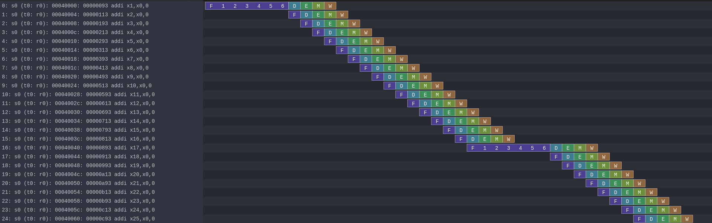

## Analysis scripts
Collection of custom and open source tools are provided for profiling, analysis, and visualization

### Flat profile
Similar to the GNU Profiler `gprof`, flat profile script provides samples/time spent in all executed functions, and prints it to the `stdout`

```sh
./sim/script/prof_stats.py -t examples/dhrystone_dhrystone_out_cosim/callstack_folded_clk_cycle.txt -e cycle --plot
```

```
Profile - Cycle
  %[c]   cumulative[c]    self[c]   total[c]   self[us]  total[us]   symbol
 14.15           14.15      86232      86232      862.3      862.3   strcpy
 14.04           28.19      85608     597440      856.1     5974.4   main
 11.65           39.84      71038     113048      710.4     1130.5   Proc_1
 10.67           50.51      65018      65018      650.2      650.2   strcmp
  5.69           56.20      34708      46440      347.1      464.4   _write
  5.58           61.78      34020     104044      340.2     1040.4   Func_2
  4.94           66.72      30096      30096      301.0      301.0   __udivsi3
  4.29           71.00      26128      72568      261.3      725.7   __puts_uart
  4.23           75.23      25764     107038      257.6     1070.4   mini_vpprintf
  4.10           79.33      25010      25010      250.1      250.1   Proc_8
  3.61           82.94      22012      25012      220.1      250.1   Proc_6
  2.95           85.90      18006      18006      180.1      180.1   Proc_7
  2.46           88.36      15008      15008      150.1      150.1   Func_1
  2.13           90.49      12998      12998      130.0      130.0   Proc_3
  1.97           92.47      12033      12033      120.3      120.3   clear_bss_w_loop
  1.92           94.39      11732      11732      117.3      117.3   send_byte_uart0
  1.48           95.87       9006       9006       90.1       90.1   Proc_2
  1.48           97.34       9000       9000       90.0       90.0   Proc_4
total_samples : 609603
clk_mhz : 100.0
total_time : 6096.03
time_unit : us

(Showing top 18 of 40 entries after filtering - Threshold: 1%)
```

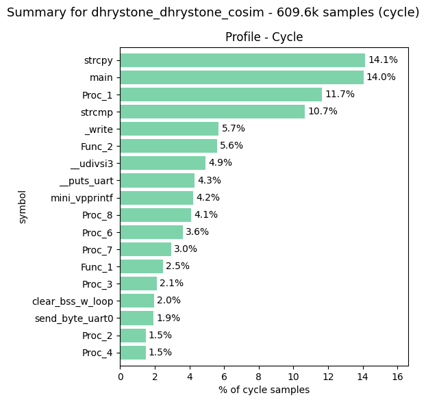

It's also possible to combine RTL and ISA sim callstacks to get more detailed breakdown (care should be taken that callstacks are produced with the same binary and in the same profiling region)

```sh
./sim/script/prof_stats.py -t sim/examples/dhrystone_dhrystone_out/callstack_folded_inst.txt -s examples/dhrystone_dhrystone_out_cosim/callstack_folded_clk_cycle.txt --plot --ipc
```

```
Profile - Inst/Cycles combined 
  %[i]   cumulative[i]    self[i]   total[i]     %[c]   cumulative[c]    self[c]   total[c]   self[us]  total[us]     ipc     cpi   symbol
 16.54           16.54      86172      86172    14.15           14.15      86232      86232      862.3      862.3   0.999   1.001   strcpy
 12.15           28.68      63291     510433    14.04           28.19      85608     597440      856.1     5974.4   0.854   1.170   main
 10.36           49.98      54000      90000    11.65           39.84      71038     113048      710.4     1130.5   0.796   1.256   Proc_1
 10.94           39.62      57000      57000    10.67           50.51      65018      65018      650.2      650.2   0.877   1.141   strcmp
  6.00           55.98      31272      41316     5.69           56.20      34708      46440      347.1      464.4   0.890   1.124   _write
  5.37           61.36      28000      90000     5.58           61.78      34020     104044      340.2     1040.4   0.865   1.156   Func_2
  4.88           66.24      25428      25428     4.94           66.72      30096      30096      301.0      301.0   0.845   1.184   __udivsi3
  3.83           82.82      19968      61284     4.29           71.00      26128      72568      261.3      725.7   0.845   1.184   __puts_uart
  4.12           75.15      21475      90087     4.23           75.23      25764     107038      257.6     1070.4   0.842   1.188   mini_vpprintf
  4.80           71.03      25000      25000     4.10           79.33      25010      25010      250.1      250.1   1.000   1.000   Proc_8
  3.84           78.99      20000      23000     3.61           82.94      22012      25012      220.1      250.1   0.920   1.087   Proc_6
  2.30           88.00      12000      12000     2.95           85.90      18006      18006      180.1      180.1   0.666   1.500   Proc_7
  2.88           85.70      15000      15000     2.46           88.36      15008      15008      150.1      150.1   0.999   1.001   Func_1
  1.73           95.42       9000       9000     2.13           90.49      12998      12998      130.0      130.0   0.692   1.444   Proc_3
  2.04           90.04      10616      10616     1.97           92.47      12033      12033      120.3      120.3   0.882   1.133   clear_bss_w_loop
  1.93           91.97      10044      10044     1.92           94.39      11732      11732      117.3      117.3   0.856   1.168   send_byte_uart0
  1.73           93.70       9000       9000     1.48           95.87       9006       9006       90.1       90.1   0.999   1.001   Proc_2
  1.73           97.15       9000       9000     1.48           97.34       9000       9000       90.0       90.0   1.000   1.000   Proc_4
total instructions : 521118
total cycles : 609603
total time : 6096.03
clk MHz : 100.0
time unit : us
CPI : 1.17
IPC : 0.855

(Showing top 18 of 40 entries after filtering - Threshold: 1%)
```

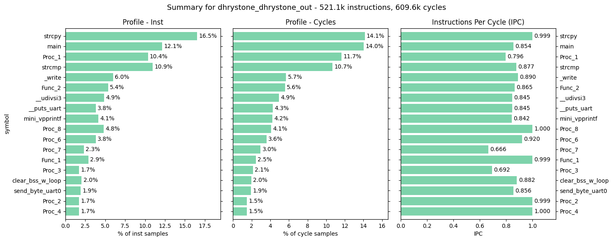

### TDA
Top-down analysis can be run based on the collected performance counters  
By default, script will open up plots in the default browser. The `-r <arg>` passes argument straight to `plotly`'s renderer argument. Using `-r notebook` or `-r png` is useful when running form jupyter notebook. The `-r png` simply streams png contents to stdout

```sh
./sim/script/tda.py examples/dhrystone_dhrystone_out_cosim/hw_stats.json
```

```
TDA for 'dhrystone_dhrystone_cosim'
         L1       L2  cycles
0  bad_spec     <NA>   11692
1  frontend   icache   25775
2  frontend     core   46460
3   backend   dcache    1805
4   backend     core    4840
5  retiring  integer  519031
6  retiring     simd       0
```

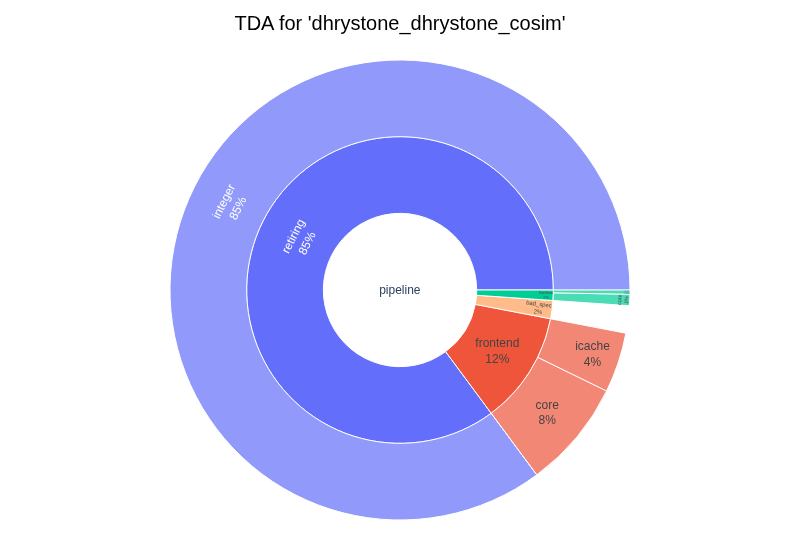

```
Performance Counters for 'dhrystone_dhrystone_cosim' (IPC: 0.851)
           counter  value    class  count
            cycles 609603   cycles 609.6k
               ret 519031      ret 519.0k
            stalls  90572    stall  90.6k
          bad_spec  11692 bad_spec  11.7k
           ret_int 519031    ret_* 519.0k
     ret_ctrl_flow 108436    ret_* 108.4k
  ret_ctrl_flow_br  63985    ret_*  64.0k
   ret_ctrl_flow_j  21746    ret_*  21.7k
  ret_ctrl_flow_jr  22705    ret_*  22.7k
           ret_mem 166065    ret_* 166.1k
      ret_mem_load  87869    ret_*  87.9k
     ret_mem_store  78196    ret_*  78.2k
          ret_simd      0    ret_*      0
    ret_simd_arith      0    ret_*      0
 ret_simd_data_fmt      0    ret_*      0
          stall_be   6645  stall_*  6.64k
     stall_be_core   4840  stall_*  4.84k
          stall_fe  72235  stall_*  72.2k
     stall_fe_core  46460  stall_*  46.5k
         stall_l1d   1805  stall_*  1.80k
       stall_l1d_r    290  stall_*    290
       stall_l1d_w   1515  stall_*  1.51k
         stall_l1i  25775  stall_*  25.8k
        stall_load   4840  stall_*  4.84k
        stall_simd      0  stall_*      0
          l1i_miss   5172    l1i_*  5.17k
           l1i_ref 530723    l1i_* 530.7k
     l1i_spec_miss   2061    l1i_*  2.06k
 l1i_spec_miss_bad   1034    l1i_*  1.03k
l1i_spec_miss_good   1027    l1i_*  1.03k
          l1d_miss    206    l1d_*    206
        l1d_miss_r     29    l1d_*     29
        l1d_miss_w    177    l1d_*    177
           l1d_ref 162718    l1d_* 162.7k
         l1d_ref_r  86196    l1d_*  86.2k
         l1d_ref_w  76522    l1d_*  76.5k
     l1d_writeback    142    l1d_*    142
```

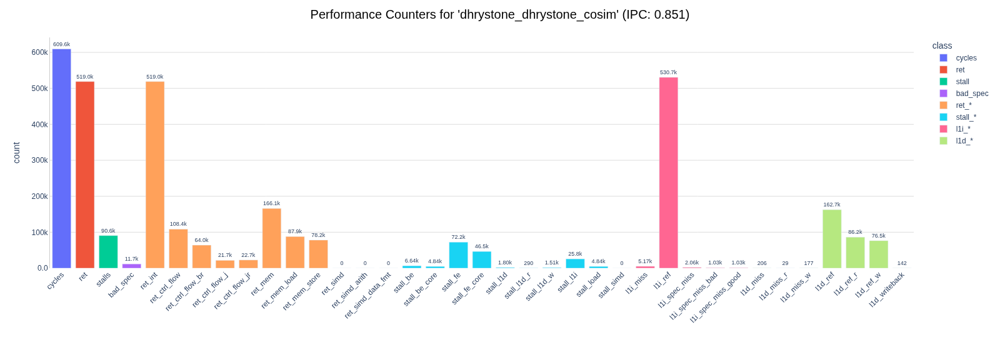

### FlameGraph
``` sh
./sim/script/get_flamegraph.py examples/dhrystone_dhrystone_out_cosim/callstack_folded_clk_cycle.txt
```
Open the generated interactive `flamegraph_clk_cycle.svg` in the web browser

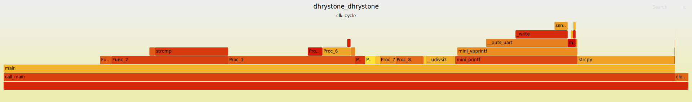

### Call Graph  

``` sh
./sim/script/get_call_graph.py examples/dhrystone_dhrystone_out_cosim/callstack_folded_clk_cycle.txt
```

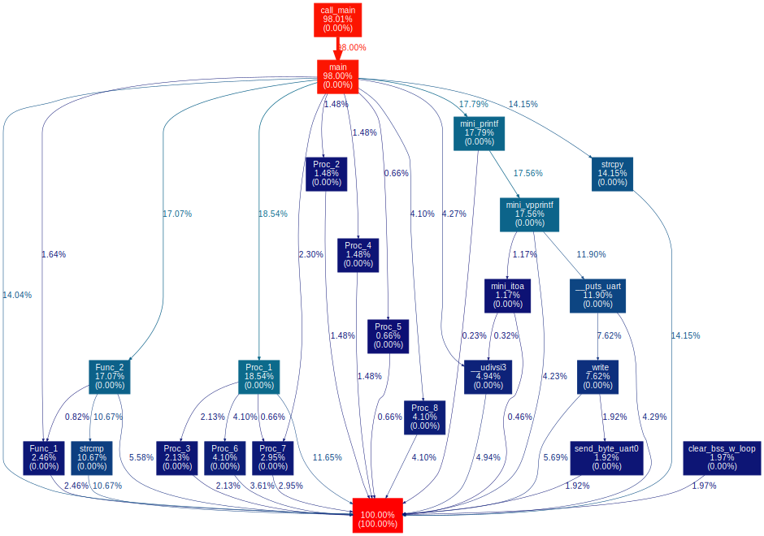


### Execution visualization

> [!NOTE]
> Running any of the below commands with `-b` will open (or host with `--host`) interactive session in the browser

Get timeline plot
```sh
./sim/script/run_analysis.py -t examples/dhrystone_dhrystone_out_cosim/trace_clk.bin --dasm sim/sw/baremetal/dhrystone/dhrystone.dasm --timeline --clk
```

Get stats trace (adjust window sizes as needed)
```sh
./sim/script/run_analysis.py -t examples/dhrystone_dhrystone_out_cosim/trace_clk.bin --dasm sim/sw/baremetal/dhrystone/dhrystone.dasm --stats_trace --win_size_stats 512 --win_size_hw 64 --clk
```

Get execution breakdown
```sh
./sim/script/run_analysis.py -i examples/dhrystone_dhrystone_out_cosim/inst_profile_clk.json --clk
```

Get execution histograms
```sh
./sim/script/run_analysis.py -t examples/dhrystone_dhrystone_out_cosim/trace_clk.bin --dasm sim/sw/baremetal/dhrystone/dhrystone.dasm --pc_hist --add_cache_lines --clk
./sim/script/run_analysis.py -t examples/dhrystone_dhrystone_out_cosim/trace_clk.bin --dasm sim/sw/baremetal/dhrystone/dhrystone.dasm --dmem_hist --add_cache_lines --clk
```

Get execution trace
```sh
./sim/script/run_analysis.py -t examples/dhrystone_dhrystone_out_cosim/trace_clk.bin --dasm sim/sw/baremetal/dhrystone/dhrystone.dasm --pc_trace --add_cache_lines --clk
./sim/script/run_analysis.py -t examples/dhrystone_dhrystone_out_cosim/trace_clk.bin --dasm sim/sw/baremetal/dhrystone/dhrystone.dasm --dmem_trace --add_cache_lines --clk
```

Optionally, save symbols found in `dasm` with `--save_symbols`

> [!NOTE]
> Any time `./sim/script/run_analysis.py` is invoked with `--dasm` arg, backannotated dasm will be saved, e.g `dhrystone.prof.dasm`


***Timeline***  

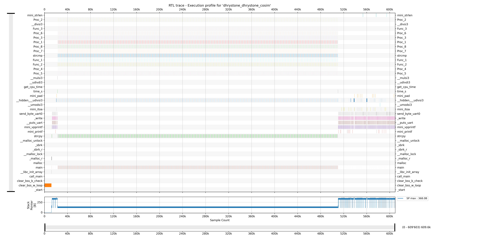

***Stats Trace***  

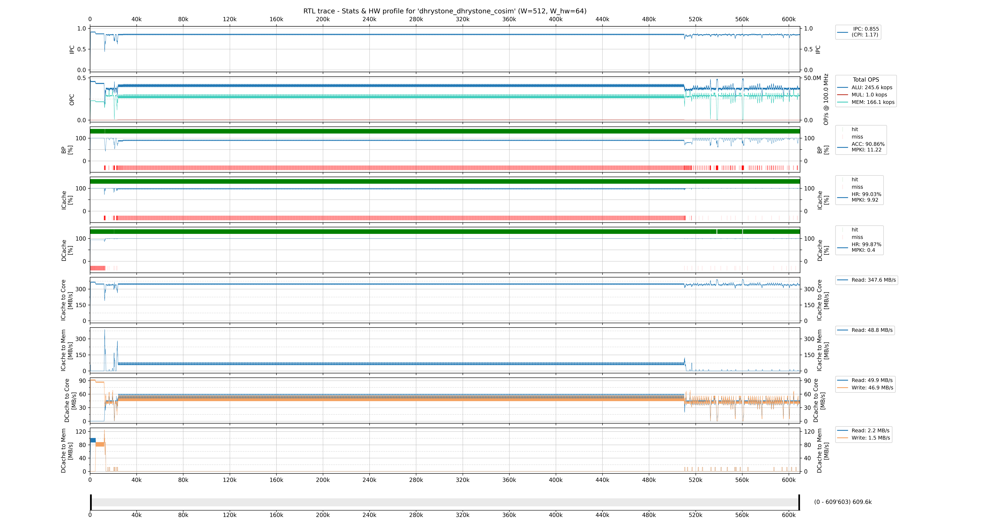

***Execution breakdown***

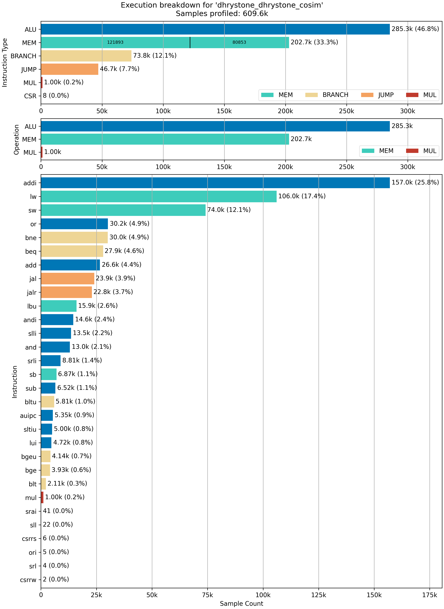

***Execution histograms***

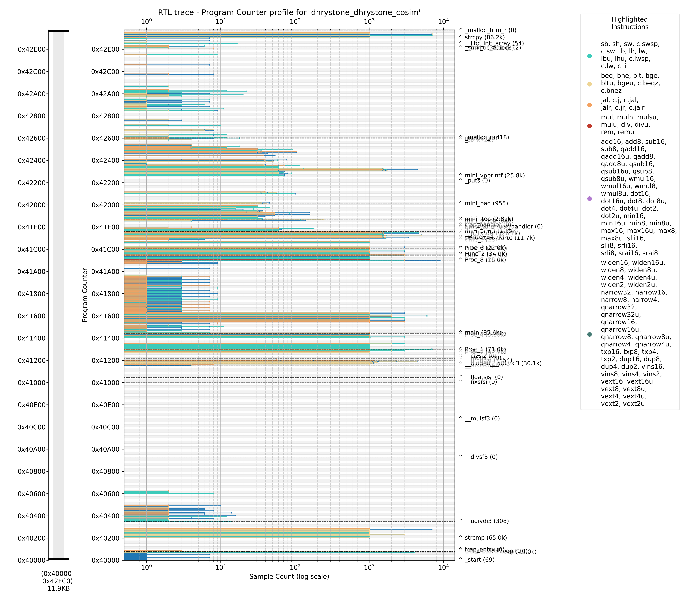
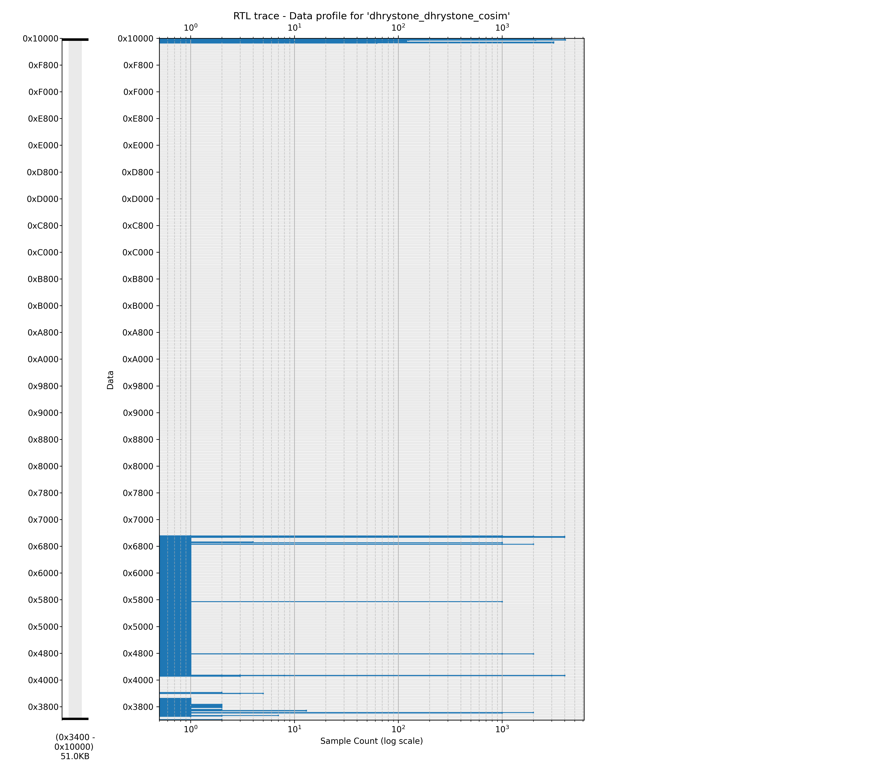

***Execution trace***

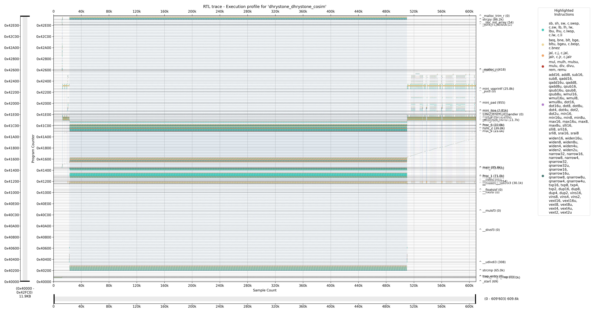
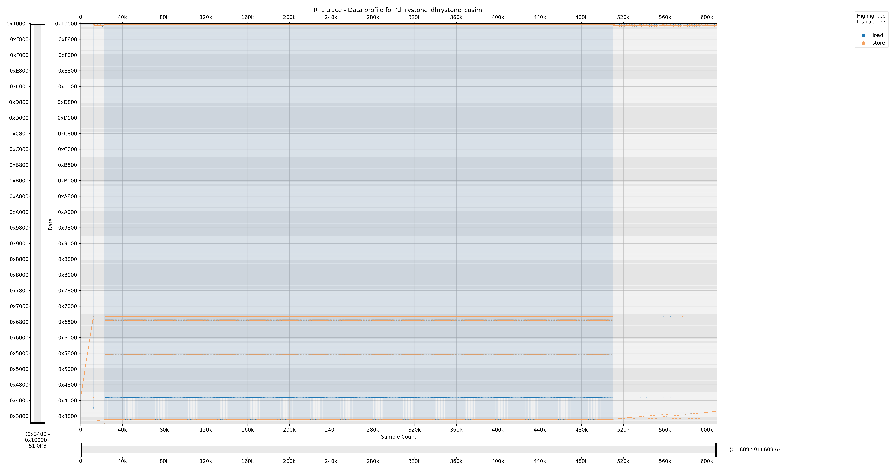

***Backannotation of disassembly***

Adding `--print_symbols` to any of the commands using `-t` will print all found symbols to `stdout`
```
Symbols found in sim/sw/baremetal/dhrystone/dhrystone.dasm in 'text' section:
0x430EC - 0x433D8: _free_r (0)
0x42FAC - 0x430E8: _malloc_trim_r (0)
0x42F08 - 0x42FA8: strcpy (86.2k)
0x42E7C - 0x42F04: __libc_init_array (54)
0x42E20 - 0x42E78: _sbrk_r (38)
0x42E1C - 0x42E1C: __malloc_unlock (2)
0x42E18 - 0x42E18: __malloc_lock (8)
0x42608 - 0x42E14: _malloc_r (418)
0x425FC - 0x42604: malloc (28)
0x425D4 - 0x425F8: _sbrk (21)
0x42298 - 0x425D0: mini_vpprintf (25.8k)
0x42224 - 0x42294: _puts (0)
0x42018 - 0x42220: mini_pad (955)
0x41EB0 - 0x42014: mini_itoa (2.81k)
0x41E88 - 0x41EAC: mini_strlen (648)
0x41E2C - 0x41E84: trap_handler (0)
0x41E00 - 0x41E28: timer_interrupt_handler (0)
0x41DEC - 0x41DFC: get_cpu_time (12)
0x41D98 - 0x41DE8: mini_printf (1.39k)
0x41D64 - 0x41D94: __puts_uart (26.1k)
0x41D14 - 0x41D60: _write (34.7k)
0x41CFC - 0x41D10: send_byte_uart0 (11.7k)
0x41CD4 - 0x41CF8: time_s (28)
0x41C14 - 0x41CD0: Proc_6 (22.0k)
0x41C08 - 0x41C10: Func_3 (3.00k)
0x41B8C - 0x41C04: Func_2 (34.0k)
0x41B6C - 0x41B88: Func_1 (15.0k)
0x41B08 - 0x41B68: Proc_8 (25.0k)
0x41AF8 - 0x41B04: Proc_7 (18.0k)
0x41478 - 0x41AF4: main (85.6k)
0x41468 - 0x41474: Proc_5 (4.01k)
0x41444 - 0x41464: Proc_4 (9.00k)
0x412F4 - 0x41440: Proc_1 (71.0k)
0x412D0 - 0x412F0: Proc_3 (13.0k)
0x412A8 - 0x412CC: Proc_2 (9.01k)
0x4125C - 0x412A4: __clzsi2 (0)
0x4122C - 0x41258: __modsi3 (0)
0x411F8 - 0x41228: __umodsi3 (354)
0x411B0 - 0x411F4: __hidden___udivsi3 (30.1k)
0x411A8 - 0x411AC: __divsi3 (2.00k)
0x41184 - 0x411A4: __mulsi3 (36)
0x41074 - 0x41180: __floatsisf (0)
0x41004 - 0x41070: __fixsfsi (0)
0x40CB8 - 0x41000: __mulsf3 (0)
0x40944 - 0x40CB4: __divsf3 (0)
0x4037C - 0x40940: __udivdi3 (308)
0x40200 - 0x40378: strcmp (65.0k)
0x400EC - 0x401FC: trap_entry (0)
0x400E8 - 0x400E8: forever (0)
0x400DC - 0x400E4: call_main (4)
0x400CC - 0x400D8: clear_bss_b_loop (0)
0x400C8 - 0x400C8: clear_bss_b_check (3)
0x400B8 - 0x400C4: clear_bss_w_loop (12.0k)
0x40000 - 0x400B4: _start (69)
```

It also backannotates the disassembly and saves it as `dhrystone.prof.dasm`
```
00040000 <_start>:
   12    40000:	00000093          	addi	x1,x0,0
    1    40004:	00000113          	addi	x2,x0,0
    1    40008:	00000193          	addi	x3,x0,0
    1    4000c:	00000213          	addi	x4,x0,0
    1    40010:	00000293          	addi	x5,x0,0
    1    40014:	00000313          	addi	x6,x0,0
...
000400b8 <clear_bss_w_loop>:
 4070    400b8:	00052023          	sw	x0,0(x10)
 2654    400bc:	00450513          	addi	x10,x10,4
 2655    400c0:	fff68693          	addi	x13,x13,-1
 2654    400c4:	fe069ae3          	bne	x13,x0,400b8 <clear_bss_w_loop>
...
00041468 <Proc_5>:
 1006    41468:	04100693          	addi	x13,x0,65
 1000    4146c:	82d186a3          	sb	x13,-2003(x3) # 44145 <Ch_1_Glob>
 1000    41470:	8201a823          	sw	x0,-2000(x3) # 44148 <Bool_Glob>
 1000    41474:	00008067          	jalr	x0,0(x1)
...
```

### Hardware performance estimates correlation
Same as with ISA sim, except now `-c/--corr` can be passed in to get correlation against the estimates  
Run with positional arguments as
```sh
./sim/script/perf_est_v2.py \
    sim/examples/dhrystone_dhrystone_out/inst_profile.json \
    sim/examples/dhrystone_dhrystone_out/hw_stats.json \
    sim/examples/dhrystone_dhrystone_out/rf_trace.bin \
    -c examples/dhrystone_dhrystone_out_cosim/hw_stats.json
```

```
Performance estimate breakdown for: 
    sim/examples/dhrystone_dhrystone_out/inst_profile.json
    sim/examples/dhrystone_dhrystone_out/hw_stats.json
    <home_path>/sim/script/hw_perf_metrics_v2.yaml
    sim/examples/dhrystone_dhrystone_out/rf_trace.bin

Peak Stack usage: 352 bytes
Instructions executed: 76.2k
    icache (32 sets, 2 ways, 4096B data): References: 76.6k, Hits: 76.2k, Misses: 368, Hit Rate: 99.52%, MPKI: 4.83
DMEM inst: 25.0k - L/S: 13.6k/11.3k (32.74% instructions)
    dcache (16 sets, 4 ways, 4096B data): References: 21.6k, Hits: 21.4k, Misses: 209, Writebacks: 145, Hit Rate: 99.03%, MPKI: 2.74
Branch inst: 10239 (13.43% instructions)
    bpred (combined): Predicted: 9.90k, Mispredicted: 341, Accuracy: 96.67%, MPKI: 4.47
DIV/REM inst: 484 (0.64% instructions)
    divider (16B): Cache: 108 (22.31%), Special: 328 (67.77%), Common: 48 (9.92%), 469 b, 9.77 b/d

Pipeline stalls (max): 
    Bad spec: 682
    FE bound: 10.4k - ICache: 2.21k (AMAT: 1.03), Core: 8.19k
    BE bound: 6.66k - DCache: 1.69k (AMAT: 1.08), Core: 4.97k (Divider 1.38k)

Estimated HW performance at 100MHz:
    Best:     87.3k cycles (873.0µs), IPC: 0.873; BW (avg MB/s) - icache: 334.5, dcache (R/W): 84.6 (44.0/40.6), mem (R/W): 50.5 (40.3/10.1)
    Expected: 94.0k cycles (939.6µs), IPC: 0.811; BW (avg MB/s) - icache: 310.8, dcache (R/W): 78.6 (40.9/37.7), mem (R/W): 46.9 (37.5/9.4)
    Estimated Cycles range: 6.66k cycles, midpoint: 90.6k, ratio: 7.34%

Correlation:
          metric   est   rtl  diff    diff%
          cycles 93958 94283  -325   -0.345
           empty 17737 18067  -330   -1.827
          stalls 17055 17039    16    0.094
            lost   682  1028  -346  -33.658
      lost_other     0    22   -22 -100.000
        bad_spec   682  1006  -324  -32.207
        stall_be  6655  6781  -126   -1.858
       stall_l1d  1689  1835  -146   -7.956
   stall_be_core  4966  4946    20    0.404
        stall_fe 10400 10258   142    1.384
       stall_l1i  2208  2063   145    7.029
   stall_fe_core  8192  8195    -3   -0.037
             ret 76216 76216     0    0.000
        ret_simd     0     0     0    0.000
         ret_int 76216 76216     0    0.000
ret_ctrl_flow_br 10239 10239     0    0.000
         bp_miss   341   503  -162  -32.207
         l1i_ref 76557 77189  -632   -0.819
        l1i_miss   368   395   -27   -6.835
         l1d_ref 21594 21594     0    0.000
        l1d_miss   209   209     0    0.000
```

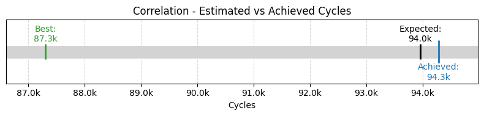

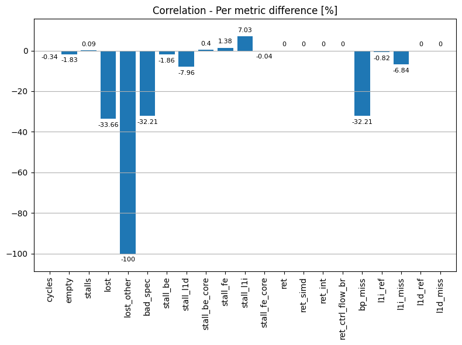
